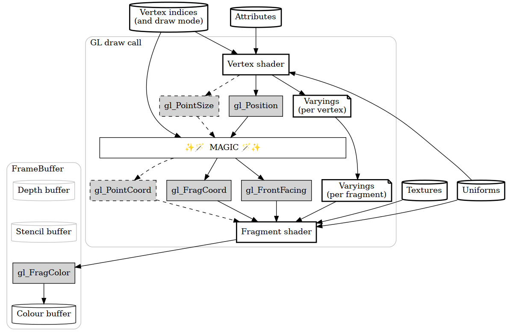

<style>

body{
	max-width: 50em;
	margin-left: auto;
	margin-right: auto;
}
img {max-width: 50em; border: 1px solid #888; border-radius: 8px; }

table { border-collapse: collapse; }
table td { border: 1px solid #444; }
table td.r { text-align: right; }

	pre code {
		display: inline-block;
		background: #eee;
	}

	code {
		background: #eee;
	}
	h2 {
		margin-top: 4em;
		margin-left: 0;
	}
</style>

# A glii primer

> [primer /ˈpraɪmə/ n](https://www.wordreference.com/definition/primer)
>
>     an introductory text, such as a school textbook
>
> Etymology: 14th Century: via Anglo-Norman from Medieval Latin *primārius* (*liber*) a first (book), from Latin *prīmārius* primary

## 0. Introduction

WebGL is *hard*. Glii tries to make it easier to understand by making some concepts explicit and renaming a couple of things.

Whenever there's WebGL (or OpenGL, or DirectX, or Vulkan), there's something called a *graphics pipeline*. Data goes into one end, graphics come out of the other end.

But it's not as easy as that. There are several inputs, several outputs, and once a WebGL program is running, it's an undebuggable [black box](https://en.wikipedia.org/wiki/Black_box). It looks something like the following diagram (try to not get scared by it, it'll get better):


(In that diagram, bold boxes are things that a programmer can configure).

It's important to keep that in mind, specially when one wants to squeeze all the functionality from the pipeline. But, when learning, it's better to ignore some of the stuff and make that diagram simpler:



Even so, the most basic use cases can ignore even more stuff, so this is the simplest data pipeline for most use cases:


So the things that can be configured for a WebGL program call are:

- Attributes (input data, per vertex)
- Uniforms (input data, per call)
- Textures (input data, per call)
- Vertex shader (a string containing GLSL programming code)
  - Gets called once per vertex
  - Inputs attributes
  - Inputs uniforms
  - Outputs varyings
  - Outputs a special variable named `gl_Position`
- Vertex indices
  - Tells the ✨🪄MAGIC🪄✨ how to assemble triangles
- Varyings
  - *Definition* of how much data goes out of the vertex shader and into the fragment shader
- Fragment shader (a string containing GLSL programming code)
  - Gets called once per fragment (AKA pixel)
  - Inputs varyings
  - Inputs uniforms
  - Inputs textures
  - Outputs a special variable named `gl_FragColor`

If you are willing to waste a bit of paper, print the last diagram and the list. It can come in handy to make sense of the data inputs and outputs.

---

The goal of this document is an introduction to how glii works, not a complete course on OpenGL/WebGL. It's a good idea to complement this primer with some of the more general WebGL texts, such as:

* [WebGL Fundamentals](https://webglfundamentals.org)
* [Learn OpenGL](https://learnopengl.com/) (low-level concepts not specific to WebGL)
* [The Book of Shaders](http://thebookofshaders.com) (an excellent manual on the GLSL shading language)
* [Mozilla Developer Network WebGL stuff](https://developer.mozilla.org/en-US/docs/Learn/WebGL)

## 1. Setup

Before diving into drawing triangles, let's make sure that a few basics of HTML and JS are covered.

I'm assuming that, if you're reading this, you already know a bit of HTML and JavaScript. If not, head to the [MDN "Getting started with the Web" learning materials](https://developer.mozilla.org/en-US/docs/Learn/Getting_started_with_the_web) first.

One of the goals of Glii is steer clear of complex toolchains, so the only things that are needed are a [text editor](https://developer.mozilla.org/en-US/docs/Learn/Getting_started_with_the_web/Installing_basic_software#Installing_a_text_editor) (*any* text editor) and a [local webserver](https://developer.mozilla.org/en-US/docs/Learn/Common_questions/set_up_a_local_testing_server) (*any* webserver).

Let's start from scratch, with a very empty webpage:

```html
<!DOCTYPE html>
<html>
	<head><meta charset="utf-8" /></head>
	<body>
	</body>
</html>
```

That webpage is going to need a [`<canvas>`](https://developer.mozilla.org/en-US/docs/Web/HTML/Element/canvas) so glii can draw stuff into it, so let's change that into:

```html
<!DOCTYPE html>
<html>
	<head><meta charset="utf-8" /></head>
	<body>
		<canvas height="500" width="500" id="glii-canvas"></canvas>
	</body>
</html>
```

And since we'll be doing JavaScript, we'll need a `<script>` somewhere. Since glii is written as [JavaScript modules](https://developer.mozilla.org/en-US/docs/Web/JavaScript/Guide/Modules), that needs to be a `<script type='module'>`:

```html
<!DOCTYPE html>
<html>
	<head><meta charset="utf-8" /></head>
	<body>
		<canvas height="500" width="500" id="glii-canvas"></canvas>
		<script type="module">
			/* JavaScript goes here */
		</script>
	</body>
</html>
```

Then, we load the main glii module using [`import`](https://developer.mozilla.org/en-US/docs/Web/JavaScript/Reference/Statements/import). If you never used `import`s in plain HTML+JS, the following code snippet is *kinda* similar to `<script src='path_to_glii_files/index.mjs'>`. Beware your relative/absolute URIs, and load glii's files from wherever it's appropriate.

```html
<script type="module">
	import { GLFactory as Glii } from "path_to_glii_files/index.mjs";
</script>
```

Glii exposes just one `export` - a JavaScript `class` named `GLFactory`. Give it a reference to a `HTMLCanvasElement`:

```html
<script type="module">
	import { GLFactory as Glii } from "path_to_glii_files/index.mjs";
	const canvas = document.getElementById("glii-canvas")
	const glii = new Glii(canvas);
</script>
```

Or, in a more compact form:

```html
<script type="module">
	import { GLFactory as Glii } from "path_to_glii_files/index.mjs";
	const glii = new Glii(document.getElementById("glii-canvas"));
</script>
```

Please note that, like other libraries, glii uses [camel case](https://en.wikipedia.org/wiki/Camel_case) for naming: `UpperCamelCase` for classes, and `lowerCamelCase` for instances.

The `glii` instance of `GLFactory` doesn't have any funcionality by itself. Instead, it defines wrapped `class`es. The most basic functionality is provided by the `WebGL1Clear` class, which clears the `<canvas>` with the given colour.

Now, get an instance of `WebGL1Clear` (implicitly tied to the canvas) by doing `new glii.WebGL1Clear(...)`.

The `WebGL1Clear` contructor takes one parameter, a key-value map of options. For this basic example, let's set the clear colour to 20% red, 30% green, 40% blue and full opacity by doing:

```js
const clearOperation = new glii.WebGL1Clear({ color: [0.2, 0.3, 0.4, 1.0] });
```

Finally, the clear operation runs when its `run()` method is invoked, i.e.:

```js
clearOperation.run();
```

Putting everything together, a complete example looks like:

```html
<!DOCTYPE html>
<html>
	<head><meta charset="utf-8" /></head>
	<body>
		<canvas height="500" width="500" id="glii-canvas"></canvas>
		<script type="module">
			import { GLFactory as Glii } from "path_to_glii_files/index.mjs";

			const glii = new Glii(document.getElementById("glii-canvas"));

			const clearOperation = new glii.WebGL1Clear({ color: [0.2, 0.3, 0.4, 1.0] });

			clearOperation.run();
		</script>
	</body>
</html>
```

At this point, you should copy-paste that complete example into a new text file, change `path_to_flii_files` to the actual path where glii is available, and point your browser to your local development webserver to visit the page. Try changing the clear colour!

Remember to use the [debugging tools available in your browser](https://developer.mozilla.org/en-US/docs/Learn/Common_questions/What_are_browser_developer_tools) to check if there's anything wrong - javascript console section to look for errors, and network section to see if glii's `index.mjs` is being loaded from the right location.

If you cannot get this minimal example working, go back to the basics at [MDN "Getting started with the Web" learning materials](https://developer.mozilla.org/en-US/docs/Learn/Getting_started_with_the_web).


## 2. One red triangle

It's still a lot to take in, so for a first program let's not use any varyings, uniforms or textures. Let's do... a red triangle (like in one of the basic [LearnOpenGL lessons](https://learnopengl.com/Getting-started/Hello-Triangle)):


The ✨🪄MAGIC🪄✨ shall need to assemble one triangle; this means three vertices each with their own position on the `<canvas>`, and we'll want those coordinates to be 2-dimensional (with X and Y).

The first thing to do is some preparations: there's a webpage that needs to have a `<canvas>`, and create a glii `GLFactory` pointing to that `<canvas>` (this will implicitly set the default output to that canvas):

```html
<canvas height="500" width="500" id="glii-canvas"> </canvas>

<script type="module">
	import { GLFactory as Glii } from "path_to_glii/index.mjs";

	const glii = new Glii(document.getElementById("glii-canvas"));

	/* rest of the JS code will go here */
</script>
```


The position coordinates of the vertices are stored in *attributes*. Think of attributes as a table. For this example, it will look like this:

<table>
<tr><td>Vertex index</td><td>position.x</td><td>position.y</td></tr>
<tr><td>0</td><td class='r'>-0.5</td><td class='r'>-0.5</td></tr>
<tr><td>1</td><td class='r'>+0.5</td><td class='r'>-0.5</td></tr>
<tr><td>2</td><td class='r'>0</td><td class='r'>+0.5</td></tr>
</table>

So the next step is to define such a thing in glii. This javascript code will create a place to hold a single attribute (we want it to hold 2-dimensional coordinates, so the GLSL data type is `vec2`, short for 2-component vector):

```js
const positions = new glii.SingleAttribute({ glslType: "vec2" });
```

...and fill in the data:

```js
positions.set(0, [-0.5, -0.5]);
positions.set(1, [ 0.5, -0.5]);
positions.set(2, [   0, +0.5]);
```

A glii `SingleAttribute` can hold data for a single attribute, for an indeterminate number of vertices. The GLSL type of the attribute it can hold is either `float`, `vec2`, `vec3` or `vec4`.

Now let's set up a triangle with vertices 0, 1 and 2:

```
const indices = new glii.IndexBuffer({ size: 3 });
indices.set(0, [0, 1, 2]);
```

By default, an `IndexBuffer` will use the `TRIANGLES` draw mode (let's not get into other draw modes just yet), and it will assemble each triplet of vertex indices into one triangle.

Let's go onto the vertex shader; its job is to set the value of the predefined `gl_Position` variable. `gl_Position` is a 4-component vector (or `vec4`), and we'll have a `vec2` attribute per vertex, so the code for this is gonna be:

```glsl
void main() {
	gl_Position = vec4(aPos, 0.0, 1.0);
}
```

That's not javascript, and that's not C. That's a programming language called GLSL, created for use within OpenGL/WebGL. It's C-like so it should feel familiar, but can handle 2-, 3- and 4-component vectors in some fancy ways. That vertex shader sets the X and Y components of `gl_Position` to the X and Y components of the `aPos` attribute, then the Z (3rd) component to zero, and the W (4th) component to 1.

(The Z component must be between -1.0 and 1.0, and the W component should be 1.0. If not, things might not draw as you expect because of how the ✨🪄MAGIC🪄✨ works.)

Why are we using values between -1.0 and 1.0, anyway? Shouldn't those be pixel coordinates? Well, OpenGL/WebGL works with something called *normalized device coordinates* (also known as *clipspace* or *clip-space coordinates* elsewhere). I'm gonna borrow an image from [learnopengl.com](https://learnopengl.com/Getting-started/Hello-Triangle) to illustrate (image is [CC-by 4.0](https://creativecommons.org/licenses/by-nc/4.0/) by [Joey de Vries](https://joeydevries.com)):


The only missing part is the fragment shader. We're doing red, so the code shall be:

```glsl
void main() {
	gl_FragColor = vec4(1.0, 0.0, 0.0, 1.0);
}
```

In there, `gl_FragColor` is set to a 4-component vector which corresponds to the RGBA (red/green/blue/alpha) values of the ouput colour; values must be between 0 and 1 (lower than 0 gets clamped up to 0, and higher than 1 gets clamped down to 1).

Also note that the number constants in GLSL code are `0.0` and `1.0` instead of `0` and `1` - this is because GLSL is nitpicky about *integer* constants and *floating-point* constants, and `vecN` variables are implied floating-point. **A newbie mistake is to forget writing a `.` in the numbers**, and shall trigger a compilation error.

Now that we have all the inputs ready (attributes, vertex indices, vertex shader and fragment shader), they can be tied together in a glii `WebGL1Program`:

```js
const program = new glii.WebGL1Program({
	attributes: { aPos: positions, },
	vertexShaderSource: `
		void main() {
			gl_Position = vec4(aPos, 0.0, 1.0);
		}`,
	fragmentShaderSource: `
		void main() {
			gl_FragColor = vec4(1.0, 0.0, 0.0, 1.0);
		}`,
	indexBuffer: indices,
});
```

The only non-trivial thing there is that the `SingleAttribute` named `position` in javascript is gonna be named `aPos` in the GLSL code for the vertex shader. It's most usual to put a `a` at the start of all attribute names in GLSL (i.e. [hungarian notation](https://en.wikipedia.org/wiki/Hungarian_notation)).


Putting everything together, this is how the whole webpage for this example looks like:

```html
<!DOCTYPE html>
<html>
	<head><meta charset="utf-8" /></head>
	<body>
		<canvas height="500" width="500" id="glii-canvas"></canvas>

		<script type="module">
			import { GLFactory as Glii } from "../src/index.mjs";

			const glii = new Glii(document.getElementById("glii-canvas"));

			const positions = new glii.SingleAttribute({ glslType: "vec2" });

			const indices = new glii.IndexBuffer();

			indices.set(0, [0, 1, 2]);

			positions.set(0, [-0.5, -0.5]);
			positions.set(1, [ 0.5, -0.5]);
			positions.set(2, [   0, +0.5]);

			const program = new glii.WebGL1Program({
				attributes: { aPos: positions, },
				vertexShaderSource: `
void main() {
	gl_Position = vec4(aPos, 0.0, 1.0);
}`,
				fragmentShaderSource: `
void main() {
	gl_FragColor = vec4(1.0, 0.0, 0.0, 1.0);
}`,
				indexBuffer: indices,
			});

			program.run();
		</script>
	</body>
</html>
```

At this point, you can try changing the coordinates of each vertex, and the output colour of the fragment shader.

# 2. Interlude: de-duplicating attribute definitions in GLSL

The previous chapter skimmed through the GLSL language.

If you want to learn GLSL, one of the best resources out there is Patricio González's [Book of Shaders](https://thebookofshaders.com). [WebGL Fundamentals](https://webglfundamentals.org/webgl/lessons/webgl-shaders-and-glsl.html) also covers some basics of GLSL.

However, if you already have experience working with GLSL shaders, you might have noticed something weird in the GLSL code for the vertex shader... it's missing the `attribute vec2 aPos;` definition.

This is because glii's design aims to de-duplicate the definitions of inputs and outputs, as much as possible. A glii `WebGL1Program` is aware of the defined attributes (and, as we'll see later, varyings, uniforms and textures), and will automatically modify the shader source code to add those attribute definitions.


# 3. Multicolour triangle

Let's follow with a classic OpenGL/WebGL example, a multicoloured triangle:


In here, there are only three vertices, each of them with a different colour (red, green or blue). Because of the way OpenGL/WebGL does magic to assemble triangles, it's possible to interpolate data between vertices (in this case, the colour).

So, this will need one more attribute per vertex, with some values:

```js
const colours   = new glii.SingleAttribute({ glslType: "vec3" });

colours.set(0, [1,0,0]);	// Red
colours.set(1, [0,1,0]);	// Green
colours.set(2, [0,0,1]);	// Blue
```

This means that now we have two data dables, one with position coordinates and one for colour components:

<table>
<tr><td>Vertex index</td><td>position.x</td><td>position.y</td></tr>
<tr><td>0</td><td class='r'>-0.5</td><td class='r'>-0.5</td></tr>
<tr><td>1</td><td class='r'>+0.5</td><td class='r'>-0.5</td></tr>
<tr><td>2</td><td class='r'>0</td><td class='r'>+0.5</td></tr>
</table>

<table>
<tr><td>Vertex index</td><td>colour.r</td><td>colour.g</td><td>colour.b</td></tr>
<tr><td>0</td><td class='r'>1</td><td class='r'>0</td><td class='r'>0</td></tr>
<tr><td>1</td><td class='r'>0</td><td class='r'>1</td><td class='r'>0</td></tr>
<tr><td>2</td><td class='r'>0</td><td class='r'>0</td><td class='r'>1</td></tr>
</table>

A `WebGL1Program` can take several attributes, like:

```js
const program = new glii.WebGL1Program({
	attributes: {
		aPos: positions,
		aColour: colours
	},
	vertexShaderSource: /* etc */,
	fragmentShaderSource: /* etc */
	indexBuffer: /* etc */,
});
```

The next step is to define what's called a *varying*. Remember the diagrams from the first chapter? *varying*s tie together the vertex shader and the fragment shader; the vertex shader outputs varyings, and the fragment shader inputs them.

In a glii `WebGL1Program`, varyings are defined as a key-value map of names to GLSL types, like so:

```js
const program = new glii.WebGL1Program({
	attributes: /* etc */,
	vertexShaderSource: /* etc */,
	varyings: {
		vColour: 'vec3'
	},
	fragmentShaderSource: /* etc */
	indexBuffer: /* etc */,
});
```

Now the vertex shader can modify `vColour`, and the fragment shader will read it. The general idea is to copy values from *attributes* to *varyings*, then make the output colour `gl_FragColor` depend on those *varyings*, like so:

```js
const program = new glii.WebGL1Program({
	attributes: {
		aPos: positions,
		aColour: colours
	},
	vertexShaderSource: `
		void main() {
			vColour = aColour;
			gl_Position = vec4(aPos, 0.0, 1.0);
		}`,
	varyings: {
		vColour: 'vec3'
	},
	fragmentShaderSource: `
		void main() {
			gl_FragColor = vec4(vColour, 1.0);
		}`,
	indexBuffer: indices,
});
```

...and everything ties together like...

```html
<!DOCTYPE html>
<html>
	<head><meta charset="utf-8" /></head>
	<body>
		<canvas height="500" width="500" id="glii-canvas"></canvas>

		<script type="module">
			import { GLFactory as Glii } from "path_to_glii/index.mjs";

			const glii = new Glii(document.getElementById("glii-canvas"));

			const positions = new glii.SingleAttribute({ glslType: "vec2" });
			const colours   = new glii.SingleAttribute({ glslType: "vec3" });

			const indices = new glii.IndexBuffer();

			indices.set(0, [0, 1, 2]);

			positions.set(0, [-0.5, -0.5]);
			positions.set(1, [ 0.5, -0.5]);
			positions.set(2, [   0, +0.5]);

			colours.set(0, [1,0,0]);	// Red
			colours.set(1, [0,1,0]);	// Green
			colours.set(2, [0,0,1]);	// Blue

			const program = new glii.WebGL1Program({
				attributes: {
					aPos: positions,
					aColour: colours
				},
				vertexShaderSource: `
void main() {
	vColour = aColour;
	gl_Position = vec4(aPos, 0.0, 1.0);
}`,
				varyings: { vColour: 'vec3' },
				fragmentShaderSource: `
void main() {
	gl_FragColor = vec4(vColour, 1.0);
}`,
				indexBuffer: indices,
			});

			program.run();
		</script>
	</body>
</html>
```

# 5. Interlude: interleaved attributes

Seasoned OpenGL/WebGL developer might be asking: «How can I set up a buffer for interleaved attribute data?»

In other words, instead of two data structures like these...

<table>
<tr><td>Vertex index</td><td>position.x</td><td>position.y</td></tr>
<tr><td>0</td><td class='r'>-0.5</td><td class='r'>-0.5</td></tr>
<tr><td>1</td><td class='r'>+0.5</td><td class='r'>-0.5</td></tr>
<tr><td>2</td><td class='r'>0</td><td class='r'>+0.5</td>   </tr>
</table>

<table>
<tr><td>Vertex index</td><td>colour.r</td><td>colour.g</td><td>colour.b</td></tr>
<tr><td>0</td><td class='r'>1</td><td class='r'>0</td><td class='r'>0</td></tr>
<tr><td>1</td><td class='r'>0</td><td class='r'>1</td><td class='r'>0</td></tr>
<tr><td>2</td><td class='r'>0</td><td class='r'>0</td><td class='r'>1</td></tr>
</table>

...would it be possible instead to have *one* data structure, like this one:?


<table>
<tr><td>Vertex index</td><td>position.x</td><td>position.y</td><td>colour.r</td><td>colour.g</td><td>colour.b</td></tr>
<tr><td>0</td><td class='r'>-0.5</td><td class='r'>-0.5</td><td class='r'>1</td><td class='r'>0</td><td class='r'>0</td></tr>
<tr><td>1</td><td class='r'>+0.5</td><td class='r'>-0.5</td><td class='r'>0</td><td class='r'>1</td><td class='r'>0</td></tr>
<tr><td>2</td><td class='r'>0</td><td class='r'>+0.5</td>   <td class='r'>0</td><td class='r'>0</td><td class='r'>1</td></tr>
</table>

Glii allows for that - but instead of two `glii.SingleAttribute` instances, the code needs one `glii.InterleavedAttributes`, which looks like:

```js
const interleaved = new glii.InterleavedAttributes(
	/* buffer options */ ,
	/* field definitions */
);
```

e.g.:

```js
const interleaved = new glii.InterleavedAttributes(
	{ usage: glii.STATIC_DRAW },
	[
		{ glslType: 'vec2' },
		{ glslType: 'vec3' }
	]
);
```

That defines a `InterleavedAttributes` data structure with two fields - each of which can be attached to a `WebGL1Program` attribute later, like so:

```js
program = new glii.WebGL1Program({
	attributes: {
		aPos: interleaved.getBindableAttribute(0),	// First field, defined as vec2
		aColor: interleaved.getBindableAttribute(1),	// second field, defined as vec3
	},
	// etc
});
```

If interleaved attributes are important for you, check out the glii API documentation.

Granted, having fields as 0-indexed numbers is not the most developer-friendly data structure, so I

# 6. Slider uniforms

Let's plug in one more input to the program: *uniform*s.

An *uniform* is a value (a GLSL `float`, `vec2`, `vec3` or `vec4`) that is the same for all vertices and all fragments during one draw. It's *kinda* similar to a constant, with one important difference: you can `run()` a `WebGL1Program`, then *change* the uniform without recompiling, then `run()` again.

For this example, let's put a couple of sliders under the canvas, with [`<input type='range'>`](https://developer.mozilla.org/en-US/docs/Web/HTML/Element/input/range), like:

```html
<canvas height="500" width="500" id="glii-canvas"></canvas>
<div>Size:<input type="range" id="range-size" min="0" max="150"></div>
<div>Brightness:<input type="range" id="range-bright" min="0" max="100"></div>
```

Uniforms are defined in a way very much like varyings, with a key-value map as a `WebGL1Program` option, like:

```js
const program = new glii.WebGL1Program({
	/* etc */
	uniforms: {
		uSize: 'float',
		uBrightness: 'float'
	}
});
```

We can do things like multiply the `gl_Position` by `uSize` in the vertex shader, to make the triangle smaller or bigger, e.g.

```js
vertexShaderSource: `
	void main() {
		vColour = aColour;
		gl_Position = vec4(aPos, 0.0, 1.0) * uSize;
	}`,
```

And also multiply the colour by `uBrightness` in the fragment shader, e.g.:

```js
fragmentShaderSource: `
void main() {
	gl_FragColor = vec4(vColour * uBrightness, 1.0);
}`,
```

And (here comes the nice part), we can have some JavaScript code to update the uniform(s) and re-run the program every time one of the sliders change:

```js
const sliderSize = document.getElementById('range-size');
sliderSize.addEventListener('input', function(){
	program.setUniform('uSize', sliderSize.value / 100);
	console.log(sliderSize.value );
	program.run();
});

const sliderBright = document.getElementById('range-bright');
sliderBright.addEventListener('input', function(){
	program.setUniform('uBrightness', sliderBright.value / 100);
	program.run();
});
```


Putting everything together, it should look like:

```html
<!DOCTYPE html>
<html>
	<head><meta charset="utf-8" /></head>
	<body>
		<canvas height="500" width="500" id="glii-canvas"></canvas>
		<div>Size:<input type="range" id="range-size" min="0" max="200"></div>
		<div>Brightness:<input type="range" id="range-bright" min="0" max="200"></div>

		<script type="module">
			import { GLFactory as Glii } from "../src/index.mjs";

			const glii = new Glii(document.getElementById("glii-canvas"));

			const positions = new glii.SingleAttribute({ glslType: "vec2" });
			const colours   = new glii.SingleAttribute({ glslType: "vec3" });

			const indices = new glii.IndexBuffer();

			indices.set(0, [0, 1, 2]);

			positions.set(0, [-0.5, -0.5]);
			positions.set(1, [ 0.5, -0.5]);
			positions.set(2, [   0, +0.5]);

			colours.set(0, [1,0,0]);	// Red
			colours.set(1, [0,1,0]);	// Green
			colours.set(2, [0,0,1]);	// Blue

			const program = new glii.WebGL1Program({
				attributes: {
					aPos: positions,
					aColour: colours
				},
				vertexShaderSource: `
void main() {
	vColour = aColour;
	gl_Position = vec4(aPos * uSize, 0.0, 1.0);
}`,
				varyings: { vColour: 'vec3' },
				fragmentShaderSource: `
void main() {
	gl_FragColor = vec4(vColour * uBrightness, 1.0);
}`,
				indexBuffer: indices,
				uniforms: {
					uSize: 'float',
					uBrightness: 'float'
				}
			});

			program.run();

			const sliderSize = document.getElementById('range-size');
			sliderSize.addEventListener('input', function(){
				program.setUniform('uSize', sliderSize.value / 100);
				console.log(sliderSize.value );
				program.run();
			});

			const sliderBright = document.getElementById('range-bright');
			sliderBright.addEventListener('input', function(){
				program.setUniform('uBrightness', sliderBright.value / 100);
				program.run();
			});

		</script>
	</body>
</html>
```

Note that the default value for any uniform is zero (until a `setUniform` call has been made), so you'll need to change both sliders to see anything on you browser.

That was an example with `<input type='range'>`, an easy way to offer user interaction. Other typical use cases for uniforms include:

- The size of the `<canvas>`, to let a shader convert between clipspace and pixel coordinates
- The current time via `performance.now()`, for animations
- Transformation matrices, for projecting 3D data and building up a scene
- The mouse coordinates, for interaction

So, for example, it's possible to make the triangle follow the mouse/pointer by having a `vec2` uniform defined like...

```js
const program = new glii.WebGL1Program({
	/* etc*/
	uniforms: {
		uMousePos: 'vec2'
	}
});
```

...used in the vertex shader like...

```js
vertexShaderSource: `
	void main() {
		vColour = aColour;
		gl_Position = vec4(uMousePos + aPos * .25, 0.0, 1.0);
	}
`,
```

...and updated like...

```js
const canvas = document.getElementById('glii-canvas');
canvas.addEventListener('pointermove', function(ev){
	// Grab the pointer coordinates relative to the canvas,
	// and normalize them into clipspace coordinates
	// The canvas is 500px high and wide; the Y coordinate in the DOM
	// grows down, but in clipspace it grows up, so it has to be inverted.
	const rect = canvas.getClientRects()[0];
	let x = ev.clientX - rect.left;
	let y = ev.clientY - rect.top;
	x = x / 250 - 1;
	y = 1 - y / 250;

	// A setUniform() call for a vec2 takes an Array of Numbers
	program.setUniform('uMousePos', [ x, y ]);
	program.run();
});
```

